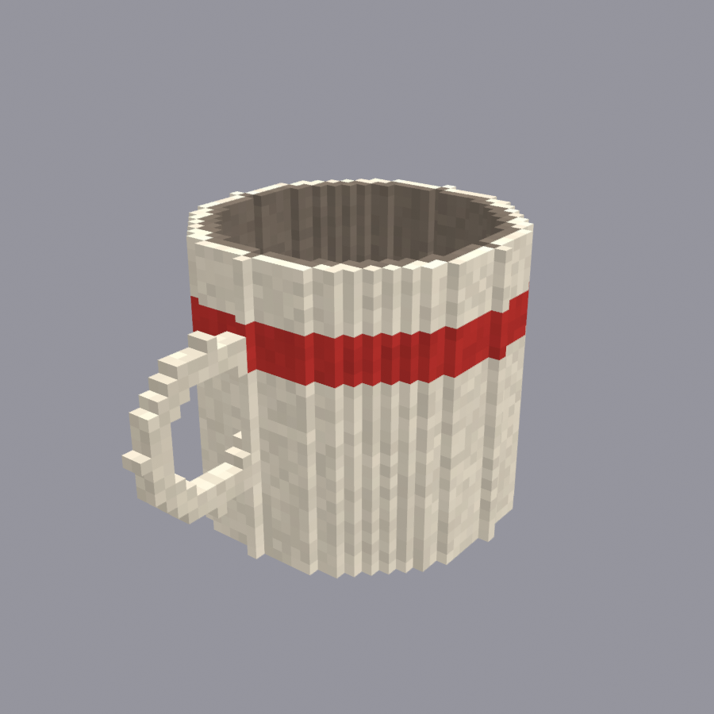

# blender-cubekit

**Pixel-style cube models for games, built in Blender by script.** One cube size for everything, every
number named, no lights, pick any single cube, stop-motion animation, straight into the game.

## What it is

A way of making game models out of little cubes, like pixel art with depth, that came out of making
VR weapons, hands and props for an old-school shooter. Close up every edge is a step; from arm's
length it reads as pixels. Everything is built by a script from a settings file, so a model is a
set of named numbers and a shape recipe, not a pile of hand-moved vertices.

This repo is the **framework only**: the scripts, a Blender add-on with the buttons and keys, and
the write-ups on how it is done. The game models made with it live in their own project folders and
are not in here.

## What is inside

| File or folder | What it is |
| --- | --- |
| `cube_size.py` | **The** cube size for a project. Every model imports it; nothing else sets it. |
| `parts.py` | Shape tools: a cube belongs to a named part; fill a box, lay a tube, cut a hole. |
| `cubes.py` | Small shape helpers with no Blender in them (ragged edges and the like). |
| `atlas.py` | Merges neighbouring faces of one colour and writes every colour into one texture. |
| `bl.py` | The Blender side: objects, the unlit scene, stop-motion keys, rendering, and **pick mode** (every cube on its own). |
| `edit.py` | Cube editing on an editing copy: add, remove, recolour; works out which cubes are solid inside. |
| `pick_mode.py` | Makes a `<model>_pick.blend` copy of any cube model where single cubes can be picked. |
| `gz_world.py` | Exporter for GZDoom: several cube models into one `.pk3`, the atlas as the skin. |
| `addon/` | The Blender add-on: the CubeKit sidebar tab and the **L** key. `make_addon_zip.py` builds it. |
| `dist/` | The add-on zip, ready to install. |
| `examples/mug/` | The smallest complete model, used by the tutorial. |
| `docs/` | [How it works](docs/HOW-IT-WORKS.md), [Tutorial](docs/TUTORIAL.md), [Buttons and keys](docs/HOTKEYS.md). |
| `archive/` | Earlier versions of files, kept for the record. |

## Install the add-on

1. Download `dist/blender_cubekit-<version>.zip` (do not unzip it).
2. In Blender: **Edit > Preferences > Add-ons**, open the small arrow menu at the top right, choose
   **Install from Disk...**, pick the zip.
3. In the 3D view press **N**: there is now a **CubeKit** tab.

Blender 4.2 or newer. The zip carries its own copy of the scripts it needs, so it works on its own;
the full repo is only needed to build models.

## The keys

- **Hover a cube, press L**: picks exactly that cube (from object mode it enters edit mode for you).
- In edit mode: **left mouse** is a picking brush (the **wheel** sizes it), **right mouse** held
  un-picks, **F** switches between sides and whole cubes, **E** adds a cube, **Q** removes one,
  **R** puts the whole model in view. A colour palette in the CubeKit tab paints what is picked.
- **Tab**: back out.

Everything else is in [docs/HOTKEYS.md](docs/HOTKEYS.md).

## The rules

1. **One cube size per project.** In `cube_size.py`, nowhere else. A hand with bigger cubes than the
   gun it holds looks like it came from a different game.
2. **Every number has a name.** Sizes, colours, timings, all in the settings file with a comment.
3. **No lights.** Materials are pure emission; the preview is the game's picture.
4. **The scripts are the model.** A `.blend` is an output. Hand edits are for trying things, then the
   change goes into the scripts and the model is rebuilt.
5. **Pick copies are never exported.** They are for pointing at cubes, and would be thirty times
   heavier in the game.
6. **Game models stay out of this repo.** Framework in here, projects in their own folders.

## Where it stands

- 2026-10-03: repo made from the shared kit folder. Pick mode and the add-on are new and have been
  used on one animated weapon with hands. Add-on 0.3.0 adds cube editing: the picking brush,
  adding and removing cubes, and a colour palette. Edits live in the editing copy; turning an
  edited copy back into a game model is not built yet. The exporter covers GZDoom only.

## Credits

- Directed by **Tefa**, whose descriptions of what a model should look like and how a hand holds a
  thing are the actual design work here; the "model a hand holding a ball, then take the ball away"
  method is theirs.
- Code and write-ups by Claude (Anthropic), working with Tefa.
- Blender, and the Blender extensions system the add-on is built on.
- Greedy meshing is an old idea from the voxel world; the version here was written from scratch.

If something in here should credit someone and does not, open an issue on this repo and it will be
fixed as soon as it is seen.

## Licence

MIT. See [LICENSE](LICENSE).
